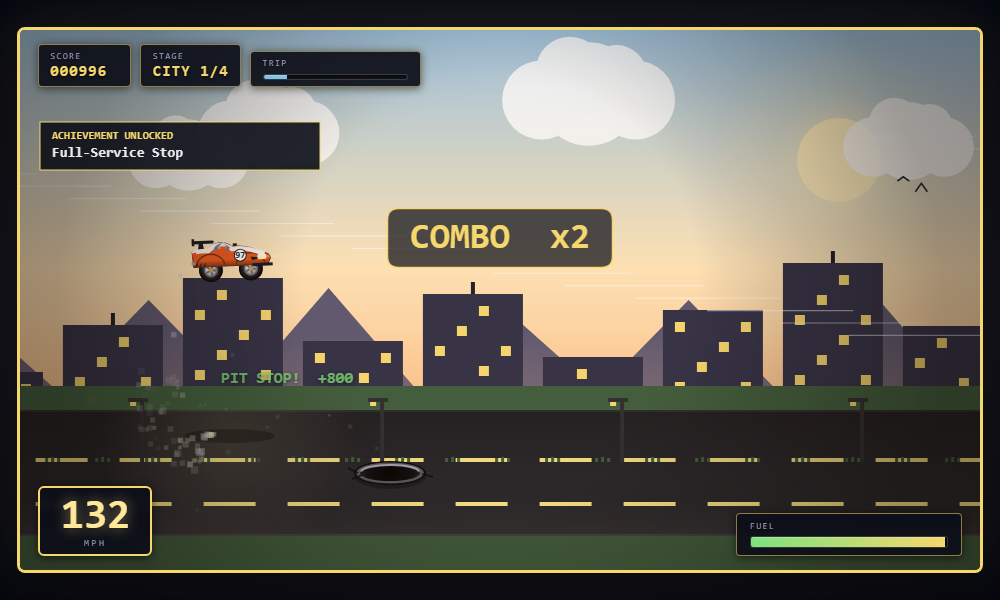
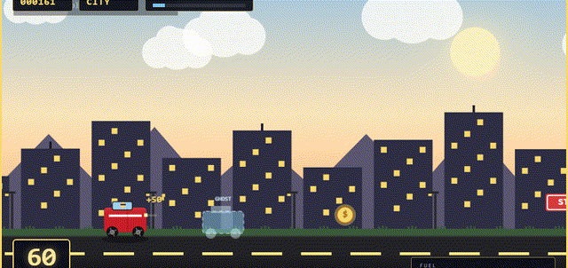

# Weekend Road Trip

[](https://github.com/fwwright1001-coder/weekend-road-trip/actions/workflows/ci.yml)
&nbsp;Vanilla JS · Zero dependencies · No build step

A three-lane arcade driver where balance and fairness are **proven by a headless
simulation**, not eyeballed — and built by orchestrating AI agents under a
process with deterministic, machine-checked gates.

**▶ Play:** https://fwwright1001-coder.github.io/weekend-road-trip/



> Drive Marty's GT coast-to-coast on one tank of gas: weave three lanes, jump
> potholes, duck low signs, skim hazards for near-miss combos, and outrun a
> difficulty curve that peaks at the coast. Reach the ocean before the tank dries.

---

## Assignment rubric → where it lives

The grad-course brief, mapped to the exact artifact that satisfies each line — checkable in 30 seconds:

| Rubric expectation | Where it lives |
|---|---|
| Playable game + title / gameplay / high-score screens, 3-char initials, persistent | `index.html` screens + `game.js` state machine; scores in `localStorage` (`wrt.highscores.v2`) |
| Game feel & polish | 5-layer parallax, particles, screen shake, **procedural Web Audio** (pitched engine + one-shot SFX, mute), 20 achievements |
| Difficulty & fairness | **proven** by [`sim/balance-sim.js`](sim/balance-sim.js) (10 acceptance criteria); rationale in [`BALANCE.md`](BALANCE.md) |
| Git / PR workflow | feature-branch-per-change, conventional commits, reviewed PRs into `main` |
| Documentation | this README + [`ARCHITECTURE.md`](ARCHITECTURE.md), [`BALANCE.md`](BALANCE.md), [`CHANGELOG.md`](CHANGELOG.md), [`CONTRIBUTING.md`](CONTRIBUTING.md) |
| Tests / CI (merge-gated) | [`sim/balance-sim.js`](sim/balance-sim.js) · [`qa/run-selftests.js`](qa/run-selftests.js) · [`qa/smoke-dom.js`](qa/smoke-dom.js) — all green-required in [CI](.github/workflows/ci.yml) |
| Edge-case handling | tab-blur `dt` clamp, `localStorage` try/catch fallbacks, focus management |
| Accessibility | OS-seeded reduce-motion, colorblind palette, ARIA live region, keyboard + gamepad + touch parity |
| AI vs. personal contribution | [`AI-CONTRIBUTIONS.md`](AI-CONTRIBUTIONS.md) — per-system human-design vs AI-code split |
| Beyond spec | finishing the drive unlocks an in-repo **Three.js sandbox second mode** ([`gta-sandbox/`](gta-sandbox/)) — original systems, still maturing |

---

## Why this repo is interesting

This is a grad-course game, but the engineering is the point:

- **A fairness invariant a machine proves.** Three lanes + jump + duck makes "is
  every layout survivable?" a real question. The spawner enforces a reachable-set
  invariant (an open lane always exists and is reachable in time), and
  [`sim/balance-sim.js`](sim/balance-sim.js) *proves* it — an optimal controller
  clears the densest legal obstacle streams with zero collisions, across 10
  acceptance criteria. It once caught a layout that was physically unsolvable at
  escalated speed, in design, before it shipped.
- **AI-orchestrated, gate-verified development.** Features were built by fleets
  of agents (parallel audits, judge-panel design, adversarial review) running in
  isolated `git worktree`s under written contracts — but every commit had to
  leave the simulation and self-tests green. Agents propose; deterministic checks
  dispose. **Full story: [ARCHITECTURE.md](ARCHITECTURE.md).**
- **Production hygiene in a toy.** DPR-aware rendering, keyboard/gamepad/touch
  parity, an accessibility pass (reduce-motion, colorblind, ARIA), CI, and a QC
  audit trail in [`qc/`](qc/).

---

## Play

Open `index.html` in any modern browser — no build, no install, no dependencies.
For best results serve locally:

```bash
python -m http.server 8090   # then open http://localhost:8090
```

### Controls

| Key | Action |
|---|---|
| `A` / `←` · `D` / `→` | Change lanes (near ↔ far) |
| `Space` / `W` / `↑` | Jump over potholes & cones |
| `S` / `↓` | Duck under low signs |
| `P` / `Esc` | Pause · `M` mute · `?` controls · `Enter` confirm |
| Gamepad / Touch | A jump, B duck, D-pad/stick or ▲▼ buttons change lanes |

The throttle is **automatic** — speed escalates each leg, so the coast is the
fastest, hairiest stretch. Your inputs are all about *positioning*.

---

## Game systems

- **Three lanes** with snappy buffered hops; dodge by lane, or jump/duck for
  full-width hazards. You can change lanes mid-jump.
- **Cross-lane obstacle patterns** — single, wall-with-one-gap, full-width walls
  (one verb clears them), and chicane weaves — always with a fair line through.
- **Climaxing difficulty:** four biomes (city dawn → forest → desert → coast
  sunset) with auto-escalating speed and rising pattern complexity.
- **Skill-dominant scoring:** uncapped combo multiplier, **near-miss** bonuses
  for skimming adjacent-lane hazards, and **lane-risk** bonuses for grabbing
  pickups in dangerous lanes (a fast weaver outscores a passive grinder ~8×).
- **Ghost Race:** records per-frame telemetry and exports/imports shareable JSON
  so anyone can race your transparent ghost — async, no backend.
- 5-layer parallax, procedural art & audio, particles + screen shake, 20
  achievements, high scores, and full local persistence.
- Keyboard + gamepad + touch; DPR-aware crisp rendering; accessibility settings.



---

## Testing & CI

```bash
node sim/balance-sim.js     # 10 balance/physics acceptance criteria (exit 0 = pass)
node qa/run-selftests.js    # persistence / settings / a11y self-tests (12 checks)
```

Both run on every push/PR via [GitHub Actions](.github/workflows/ci.yml) and were
the merge gate on every commit. See [`BALANCE.md`](BALANCE.md) for the balance
rationale and [`qc/`](qc/) for the play-test audit trail.

## Tech

Vanilla HTML5 + Canvas 2D + JavaScript; HTML/CSS overlays for menus & HUD. Single
folder, zero dependencies, no build step. MIT licensed.

## Author

Forrest Wright — Lipscomb MSAI '26 — ENGR 5513 (Applied AI in Engineering), Summer 2026
