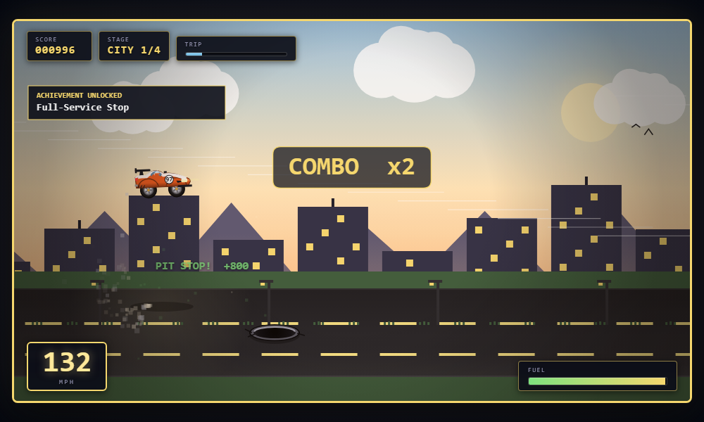
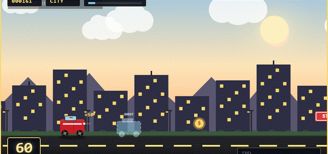

# Weekend Road Trip

[](https://github.com/fwwright1001-coder/weekend-road-trip/actions/workflows/ci.yml)

A browser road-trip game set in Nashville, Tennessee: three lanes, one tank of gas, and four legs from downtown to the Lower Broadway neon. I designed it, directed AI coding tools to build it, and verified it by play-testing and with automated checks that run on every change. It was my class project for ENGR 5513, Applied AI in Engineering, at Lipscomb University in Summer 2026.

By [Forrest Wright](https://fwwright1001-coder.github.io), Business Systems Analyst, Nashville, TN.

**Play it:** https://weekend-road-trip-forrestw200.vercel.app

**Static copy on GitHub Pages (scores stay in your browser):** https://fwwright1001-coder.github.io/weekend-road-trip/



## How it was built

This is an AI-directed build. The design decisions and the acceptance criteria were mine: the setting (a night drive through downtown Nashville, Music Row, the Cumberland riverfront and Lower Broadway on one tank of gas), the three things a player can do (change lanes, jump, duck), the rule that every obstacle layout must leave a fair line through, the scoring intent (skill should beat distance), the constraint that all art and sound be generated in code with no asset files, the accessibility options worth having (reduce motion, a colorblind palette, and equal keyboard, gamepad and touch input), the Ghost Race idea (record a run and share it as JSON so a classmate can race it), and the privacy and fallback calls for the cloud high scores (a score saves in the browser first, the cloud write is optional, and no raw IP address is stored).

AI coding tools wrote most of the code: the game itself, the balance simulation and the test scripts, the cloud high-score function, the doc drafts and the CI workflow. My merge rule: no AI-written change was accepted unless the balance simulation and the self-test harness still passed.

I verified the result three ways. I played it and sent back what felt wrong. The five automated checks below run on every push to `main` and every pull request. On the larger changes, separate AI agents reviewed the diff and played the game in a headless browser, and every finding was re-checked before it counted (reports in [`qc/`](qc/)). The simulation caught a real bug before it shipped: when the lane system raised the top speed, the fixed gap between obstacles became shorter than a jump, so a layout could not be cleared. [AI-CONTRIBUTIONS.md](AI-CONTRIBUTIONS.md) records the split, system by system.

What the tools produced: a vanilla JavaScript game on an HTML5 Canvas with no build step (`index.html`, `styles.css`, `game.js`), all art and sound drawn or synthesized in code, and an optional Vercel serverless function that keeps a cloud high-score table in Neon Postgres.

## The game

- Marty has one free night before the class demo. He points the GT through downtown Nashville, Music Row, the Cumberland riverfront and Lower Broadway, and has to reach the neon before the tank runs dry.
- Three lanes. Change lanes to dodge, jump potholes and cones, and duck under low signs. One hop per key press; a press made mid-hop is queued, and you can change lanes mid-air.
- The throttle is automatic. Speed climbs each leg, so Broadway is the fastest, tightest stretch.
- Fuel drains with time and with every hit. Jerry cans and pit stops add fuel; `$` snacks add points.
- Scoring favors skill: an uncapped combo multiplier, near-miss bonuses for skimming a hazard in the next lane, and lane-risk bonuses.
- Every obstacle pattern leaves a way through: an open lane, or a wall you can clear by jumping or ducking. The balance simulation checks that rule on every leg.
- Ghost Race: a finished run saves a replay, and the game keeps your best one. Copy the ghost JSON, paste a classmate's, and race their line. The ghost car is off by default and can be switched on in Settings.
- High scores with three-letter initials, saved locally first and synced to the cloud board on Vercel.
- Side view and chase camera, achievements, and settings for screen shake, a colorblind palette, volume, sound effects, mute and reduced motion. Keyboard, gamepad and touch all work, and screen changes, leg changes and low fuel are announced for screen readers.



## Controls

| Input | Action |
|---|---|
| `D` / Right arrow | Move toward the far lane |
| `A` / Left arrow | Move toward the near lane |
| `Space` / `W` / Up arrow | Jump over potholes and cones |
| `S` / Down arrow | Duck under low signs |
| `P` / `Esc` | Pause |
| `M` | Mute or unmute audio |
| `T` | Switch between the side and chase cameras |
| `?` | Show the controls |
| `Enter` | Confirm on menus |
| Gamepad | A jump, B duck, D-pad or stick for lanes and menus, Y camera, X mute |
| Touch | On-screen lane, jump, duck, camera and pause buttons on touch devices |

## Run it locally

No build step, and no dependencies for the game itself.

```bash
git clone https://github.com/fwwright1001-coder/weekend-road-trip
cd weekend-road-trip
npx http-server -p 8090
```

Then open `localhost:8090` in your browser. Opening `index.html` directly in a browser also works. Without a Vercel deployment, high scores stay in the browser's local storage, and the high-score screen says so.

## Tests

The tests need Node 24. The one npm dependency, `@neondatabase/serverless`, belongs to the cloud high-score function, not the game.

```bash
npm install
npm test
```

`npm test` runs five checks in order, with no browser, database or network, and stops at the first failure:

| Check | What it confirms |
|---|---|
| `sim/balance-sim.js` | A headless copy of the physics and spawn math, run against the densest legal obstacle streams and 500 seeded fuel runs per play style. Ten acceptance criteria: a symmetric jump arc, no unavoidable obstacles, an open lane reachable in time on every leg, a finale that is the hardest leg, skill outscoring distance, and fuel bands where careful runs finish and careless runs run dry. |
| `qa/run-selftests.js` | Loads the real `game.js` in a minimal browser shim and runs the in-game self-test harness: persistence round-trips, settings, the camera toggle, ghost validation and reduce-motion gates. |
| `qa/smoke-dom.js` | Every element id that `game.js` looks up exists in `index.html`, and the page has no form or email input. |
| `qa/highscores-contract.js` | The cloud high-score API, exercised without a database connection. |
| `qa/highscores-client-contract.js` | The game's cloud sync helpers, including that a failed cloud save never leaves the player stuck on the saving screen. |

[GitHub Actions](.github/workflows/ci.yml) runs the same five checks on every push to `main` and every pull request. The play-test reports, with their findings and fixes, are in [`qc/`](qc/).

## Deployment

| Surface | Details |
|---|---|
| Vercel production | https://weekend-road-trip-forrestw200.vercel.app, deployed from `main`. Each pull request also gets its own preview URL. |
| GitHub Pages | https://fwwright1001-coder.github.io/weekend-road-trip/, a static copy of the same game. Pages cannot run serverless functions, so high scores stay local there. |
| Neon Postgres (optional) | On Vercel, `api/highscores.js` writes finished runs to the `game_high_scores` table and serves the cloud board. The function creates the table on first use; [`database/schema.sql`](database/schema.sql) documents it. |

Environment variables on Vercel: `DATABASE_URL` (the Neon connection string; the Vercel Neon integration's `POSTGRES_URL` names also work) and `IP_HASH_SECRET`. The API stores a short hash of the player's IP address for light abuse protection, never the raw address. See [`.env.example`](.env.example) and [VERCEL-NEON.md](VERCEL-NEON.md).

## Docs

| File | What it covers |
|---|---|
| [ARCHITECTURE.md](ARCHITECTURE.md) | The engine's systems, the lane fairness rule, and how the game was built and checked |
| [BALANCE.md](BALANCE.md) | Difficulty, physics and fuel-economy tuning, with the simulation's numbers |
| [AI-CONTRIBUTIONS.md](AI-CONTRIBUTIONS.md) | What was my decision and what the AI tools wrote, system by system |
| [DEPLOYMENT.md](DEPLOYMENT.md) | The branch, pull request, preview, CI and production flow |
| [VERCEL-NEON.md](VERCEL-NEON.md) | Vercel and Neon setup steps |
| [CONTRIBUTING.md](CONTRIBUTING.md) | File tour and extension points for adding a feature |
| [CHANGELOG.md](CHANGELOG.md) | Dated record of changes |

## License

MIT. See [LICENSE](LICENSE).

## Author

Forrest Wright, Business Systems Analyst, Nashville, TN. MS in Applied Artificial Intelligence, Lipscomb University, expected May 2027. Open to contract and contract-to-hire work.

- Portfolio: https://fwwright1001-coder.github.io
- GitHub: https://github.com/fwwright1001-coder
- LinkedIn: https://www.linkedin.com/in/forrest-wright
- Email: forrestwright1001@gmail.com

Thank you for taking a look. Questions and bug reports are welcome as issues on this repo.
