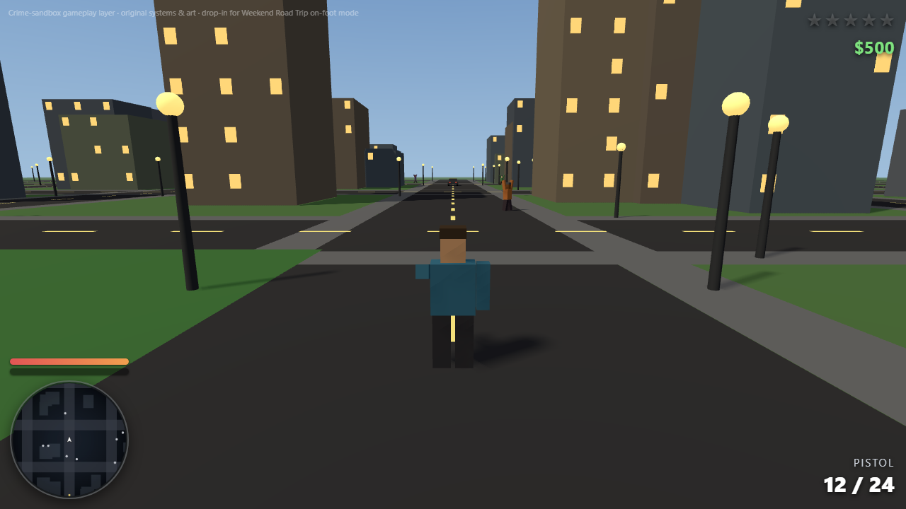

# Crime Sandbox — open-world gameplay layer

*An open-world crime sandbox that bolts onto Weekend Road Trip's on-foot mode.*

Marty finishes the coast-to-coast drive, parks the convertible, and steps out —
and the game quietly becomes something else. The boardwalk town opens into a full
low-poly city you can roam on foot or behind the wheel. Draw a weapon in the open
and the **wanted stars** start climbing; fire enough and the police roll in and
escalate, star by star, until you lose them, get **Busted**, or end up **Wasted**.
Walk up to any car, press a key, and it's yours. Take a contract from a glowing
marker and run the job. It's the open-world crime loop — pursuit, heat, getaway —
rebuilt from scratch in the browser.

Built from scratch in vanilla JavaScript and Three.js — no engine, no build step,
no external art or audio. Everything is procedural: a decoupled event-bus
architecture where every system (wanted level, police AI, vehicles, combat,
economy, missions, traffic, radar) is a self-registering module that talks only
through events. A seeded city with a real road network, AABB collision, arcade
driving, hitscan combat with health + armor, a money economy with world pickups,
a mission framework with six objective types, and a rotating GTA-style minimap —
all drawn with code-generated low-poly meshes and a self-contained Web Audio gun.

The point of the design is **drop-in**: the whole layer fails safe and bolts onto
the existing on-foot mode with a folder copy and a handful of small edits, so it
can ship the moment the on-foot foundation is ready — without ever risking the
base game.

▶ **Play it live:** https://fwwright1001-coder.github.io/weekend-road-trip/gta-sandbox/
🕹️ **Run it locally:** `cd gta-sandbox && python -m http.server 8080` → http://localhost:8080/
💻 **Repo:** https://github.com/fwwright1001-coder/weekend-road-trip/tree/main/gta-sandbox

---

## Controls
| Input | Action |
|---|---|
| **Click** the canvas | Capture the mouse (pointer-lock look) |
| **WASD** / arrows | Move · **Shift** run · **Space** jump |
| **Click** | Shoot · **R** reload |
| **1–5 / Tab** | Switch weapon (fists/pistol/SMG/shotgun/rifle) |
| **F** | Jack / enter a car — **F** again to get out |

Fire in the open to draw heat. Walk into a glowing pillar to start a mission.

## What's inside
| System | Role |
|---|---|
| `wanted.js` | 0–5 star wanted level from crime "heat", flash-then-clear decay |
| `police.js` | Police AI scaling with stars (seek → engage → arrest), cop cars |
| `combat.js` | Arsenal, health + armor, the damage pipeline, Wasted/Busted |
| `vehicles.js` | Carjack / enter / arcade drive / exit + ambient traffic |
| `peds.js` | Civilians that wander, flee gunfire, and panic at high heat |
| `economy.js` | Money ledger + world pickups (cash/health/armor/ammo) + persistence |
| `missions.js` | Objective framework (goto/eliminate/collect/deliver/survive/evade) + 3 missions |
| `hud-radar.js` | Rotating minimap, wanted stars, vitals, weapon, objective |
| `core.js` · `world.js` · `boot.js` | Event bus + system registry · procedural city · standalone host |

## Architecture
Every system is a `{ name, init, update, reset, api }` module registered into a
tiny core. Systems never touch each other's internals — they publish/consume
**bus events** (`crime`, `wanted:changed`, `damage`, `entityKilled`,
`vehicle:jacked`, `spawnPickup`, …) and expose a small `api`. Damage flows through
one shared hittable registry (`ctx.targets`) that `combat.js` raycasts against.
That decoupling is why the layer was built in parallel, why any system can be
swapped or disabled, and why a bug in one can't brick the rest — or the base game.

## Verified
- ESM syntax clean across all 13 modules
- Headless smoke test (`npm run smoke`) boots every system and runs 270 frames with
  real Three.js: wanted escalation → police spawn → player takes fire →
  carjack/drive/exit → missions — **zero throws, zero errors**
- Renders in Chrome (the screenshot above is the live page)
- Adversarial two-reviewer pass; all blocker/major findings fixed

## Legal
Clones game **mechanics** (not copyrightable); originates all expressive content.
No "GTA"/Rockstar names or marks, no copied assets, cities, characters, or music —
100% procedurally generated art and original naming. Full rationale in
[LEGAL.md](LEGAL.md). MIT licensed ([LICENSE](LICENSE)).

## Integrate it into the game
[INTEGRATION.md](INTEGRATION.md) documents the merge into `onfoot3d.js`: copy the
`gta/` folder + ~6 small marked edits. The layer is fail-safe — if it throws, the
base on-foot mode keeps running.
